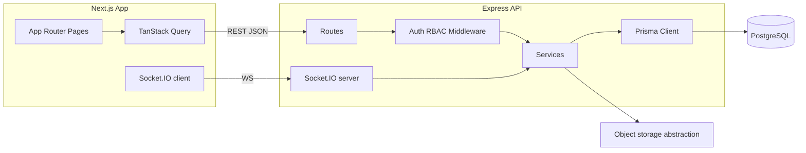
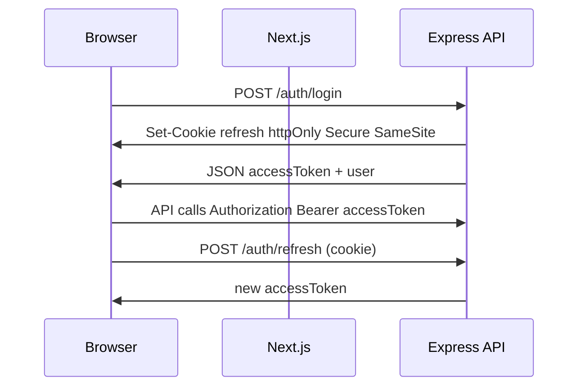

# SupportFlow — Implementation Plan

## 1. Architecture overview




- **Pattern**: Single workspace, two deployable apps (`[apps/web](apps/web)` Next.js, `[apps/api](apps/api)` Express). Optional `[packages/shared](packages/shared)` for **shared Zod schemas + TypeScript types** (API request/response shapes, enums) to keep contracts aligned without duplication.
- **API style**: REST JSON under `/api/v1/...`, version prefix for future compatibility.
- **Realtime**: Socket.IO **authenticated** on connection (handshake carries short-lived token or uses same-origin cookie session—see Auth section). Namespaces or rooms keyed by `workspaceId` (MVP: implicit single workspace) or `user:{id}` for personal notifications.
- **Uploads**: `Uploads` module with **local disk + abstract `StorageProvider` interface** (env: `STORAGE_DRIVER=local|s3-compatible`). Metadata in `Attachment`; files outside repo in Docker volume. Keeps portfolio demo simple while showing production thinking.
- **Cross-cutting**: Central `AppError` + error code mapping, `pino` or `winston` request logging, `helmet`, `cors` (allowlist frontend origin), `express-rate-limit` per IP + stricter limit on auth routes, `zod` parsing on all inputs.

---

## 2. Recommended folder structure (monorepo)

```
supportflow/
  apps/
    web/                          # Next.js App Router
      app/
        (marketing)/ page.tsx       # landing
        (auth)/ login, register
        (app)/                      # authenticated layout: sidebar + header
          dashboard/
          tickets/
            [ticketId]/
          team/
          analytics/
          settings/
          profile/                  # optional
      components/                   # ui (shadcn), features, layouts
      lib/                          # api client, query keys, socket hook, auth helpers
      hooks/
    api/                            # Express + TS
      src/
        config/                     # env schema (zod), cors, logger
        middlewares/                # auth, rbac, error, rateLimit, requestId
        modules/
          auth/
          users/
          tickets/
          comments/
          notes/
          notifications/
          activity/
          analytics/
          uploads/
        sockets/                    # io setup, handlers, emit helpers
        app.ts                      # express app factory
        server.ts                   # http + io listen
      prisma/
        schema.prisma
        seed.ts
      Dockerfile
  packages/
    shared/                         # optional but recommended
      src/
        schemas/                    # zod: shared with api + web for forms
        constants/                  # statuses, priorities, roles
  docker-compose.yml
  README.md
```

---

## 3. Monorepo vs separate repos — recommendation

**Choose a monorepo (pnpm workspaces).**


| Criterion                  | Monorepo                                           | Separate repos                      |
| -------------------------- | -------------------------------------------------- | ----------------------------------- |
| Recruiter clone experience | One clone, one `docker-compose up`, clear coupling | Two repos + version skew            |
| Shared contracts           | Same Zod/types in `packages/shared`                | Duplication or npm package overhead |
| CI/CD                      | One pipeline, matrix jobs                          | Two pipelines to keep in sync       |


Avoid overengineering: **do not** add Turborepo until build times hurt; pnpm workspaces + root scripts suffice.

---

## 4. MVP scope (realistic, portfolio-quality)

**Canonical detail:** exact tables, modules, pages, endpoints, socket events, and build order are in **section “MVP v2 — canonical specification”** below (scroll in this same file — plan viewer fragment links are unreliable in Cursor).

**In scope for MVP**

- Auth: register, login, logout, refresh or cookie session, protected API + Next.js route groups.
- RBAC: Admin / Manager / Agent enforced on server; UI hides impossible actions.
- Tickets: full CRUD with role rules (e.g. only Admin/Manager delete); all ticket fields from spec; filters, search, sort, **cursor or offset pagination** (pick one; document choice).
- Comments + internal notes: threaded (1 level or limited depth), staff-only notes, distinct UI.
- Activity log: write on key mutations; ticket timeline + dashboard “recent activity” widget.
- Notifications: persisted rows + **realtime push** + header dropdown; mark read.
- Dashboard + Analytics: **one** analytics page with charts (e.g. Recharts) + dashboard summary cards; agent workload from aggregates.
- Team page: list users, roles, workload counts, online status (from presence).
- Realtime: ticket list/detail sync, comment/note threads, notifications; presence; **typing optional** (timeboxed).
- Attachments: upload tied to ticket (MVP); comment attachments if time permits (same `Attachment` model with nullable FKs).
- Docker Compose: `postgres`, `api`, `web` (or web run locally with env pointing to API).
- Swagger at `/api-docs` (or `/docs`) with OpenAPI 3; README root + `apps/web` + `apps/api`.

**Explicitly defer or simplify for MVP**

- Multi-tenant organizations (single implicit workspace).
- Email/password only (no OAuth) unless you add one provider later.
- Advanced SLA automation, macros, CSAT, knowledge base.

---

## MVP v2 — canonical specification (recruiter-focused)

Single implicit workspace (no `organizations` table). **Attachments**: include table in schema early; ship ticket uploads **last** if time is tight.

### MVP v2.1 — Exact database tables

Prisma model names → Postgres tables (default mapping).


| Table               | Purpose                                                                |
| ------------------- | ---------------------------------------------------------------------- |
| **users**           | Accounts, roles, profile, presence                                     |
| **refresh_tokens**  | Rotating refresh tokens (hashed), optional revocation                  |
| **tickets**         | Core support work items                                                |
| **ticket_comments** | Threaded discussion (non-internal); distinct from internal notes in UI |
| **internal_notes**  | Staff-only notes, threaded                                             |
| **notifications**   | In-app notifications + realtime fanout                                 |
| **activity_logs**   | Audit/timeline + dashboard feed                                        |
| **attachments**     | File metadata (ticket first; `comment_id` / `note_id` nullable)        |


**Columns (exact fields)**

- **users**: `id` (uuid), `email` (unique), `password_hash`, `name`, `role` (enum), `avatar_url` (nullable), `last_seen_at` (nullable), `created_at`, `updated_at`
- **refresh_tokens**: `id`, `user_id` (fk), `token_hash` (unique), `expires_at`, `revoked_at` (nullable), `replaced_by_id` (nullable), `created_at`
- **tickets**: `id`, `title`, `description`, `status` (enum), `priority` (enum), `category` (text), `due_at` (nullable), `created_by_id` (fk), `assignee_id` (nullable fk), `created_at`, `updated_at`
- **ticket_comments**: `id`, `ticket_id` (fk), `author_id` (fk), `body` (text), `parent_id` (nullable self-fk), `created_at`, `updated_at`
- **internal_notes**: `id`, `ticket_id` (fk), `author_id` (fk), `body` (text), `parent_id` (nullable self-fk), `created_at`, `updated_at`
- **notifications**: `id`, `user_id` (fk), `type` (enum/text), `title`, `body` (nullable), `data` (jsonb), `read_at` (nullable), `created_at`
- **activity_logs**: `id`, `actor_id` (nullable fk), `ticket_id` (nullable fk), `action` (enum), `metadata` (jsonb), `created_at`
- **attachments**: `id`, `ticket_id` (nullable fk), `comment_id` (nullable fk), `note_id` (nullable fk), `uploaded_by_id` (fk), `original_name`, `mime_type`, `size_bytes`, `storage_key`, `created_at`

**Indexes (MVP minimum)**: `tickets (status, priority, assignee_id, created_at)`, `activity_logs (ticket_id, created_at)`, `notifications (user_id, read_at, created_at)`, `ticket_comments (ticket_id, created_at)`, `internal_notes (ticket_id, created_at)`.

### MVP v2.2 — Exact backend modules

Under `apps/api/src` (plus infrastructure):


| Module            | Path                     | Owns                                                                      |
| ----------------- | ------------------------ | ------------------------------------------------------------------------- |
| **config**        | `config/`                | Env validation (Zod), constants                                           |
| **middlewares**   | `middlewares/`           | `authenticate`, `requireRoles`, error handler, request logger, rate limit |
| **auth**          | `modules/auth/`          | Register, login, refresh, logout, `me`                                    |
| **users**         | `modules/users/`         | Team list, profile patch                                                  |
| **tickets**       | `modules/tickets/`       | CRUD, assign, list + filters + pagination                                 |
| **comments**      | `modules/comments/`      | Ticket comment CRUD                                                       |
| **notes**         | `modules/notes/`         | Internal note CRUD + RBAC                                                 |
| **notifications** | `modules/notifications/` | List, mark read, internal create                                          |
| **activity**      | `modules/activity/`      | Ticket timeline + recent feed                                             |
| **analytics**     | `modules/analytics/`     | Dashboard + chart aggregates                                              |
| **uploads**       | `modules/uploads/`       | Multipart + `Attachment` row                                              |
| **sockets**       | `sockets/`               | IO server, auth, rooms, emit wrappers                                     |


### MVP v2.3 — Exact frontend pages (App Router)

**Marketing / auth**

- `/` — Landing
- `/login`
- `/register`

**Authenticated shell** `(app)` layout: sidebar + header

- `/dashboard`
- `/tickets`
- `/tickets/[ticketId]`
- `/team`
- `/analytics`
- `/settings`

**Required UI (not standalone pages)**

- Notifications: **header dropdown** in layout
- Command palette / global search: component (optional deep-link to `/tickets`)

**Defer**: standalone `/profile` — fold into **Settings** as a tab to save a route.

### MVP v2.4 — Exact API endpoints

Base: `**/api/v1`**. All JSON; structured errors.

**Auth**

- `POST /auth/register`
- `POST /auth/login`
- `POST /auth/logout`
- `POST /auth/refresh`
- `GET /auth/me`

**Users / team**

- `GET /users`
- `GET /users/me`
- `PATCH /users/me`

**Tickets**

- `GET /tickets` — query: search, status, priority, assignee, category, from, to, sort, page, pageSize
- `POST /tickets`
- `GET /tickets/:ticketId`
- `PATCH /tickets/:ticketId`
- `DELETE /tickets/:ticketId` — Admin/Manager only (fix rule in service)
- `PATCH /tickets/:ticketId/assign` — body: `assigneeId` | null

**Comments**

- `GET /tickets/:ticketId/comments`
- `POST /tickets/:ticketId/comments`
- `PATCH /comments/:commentId`
- `DELETE /comments/:commentId`

**Internal notes**

- `GET /tickets/:ticketId/notes`
- `POST /tickets/:ticketId/notes`
- `PATCH /notes/:noteId`
- `DELETE /notes/:noteId`

**Notifications**

- `GET /notifications` — query: unreadOnly, page
- `PATCH /notifications/:notificationId/read`
- `POST /notifications/mark-all-read`

**Activity**

- `GET /tickets/:ticketId/activity`
- `GET /activity/recent`

**Analytics**

- `GET /analytics/summary`
- `GET /analytics/by-status`
- `GET /analytics/by-priority`
- `GET /analytics/agent-workload`
- `GET /analytics/weekly-activity`

**Uploads**

- `POST /uploads` — multipart: `file`, `ticketId` (MVP)
- `GET /attachments/:attachmentId/download`

**Docs**

- `GET /openapi.json`
- `GET /api-docs` — Swagger UI

### MVP v2.5 — Exact socket events

**Handshake**: client sends `auth: { token: "<accessJwt>" }`; server sets `socket.data.userId`.

**Client → server**

- `ticket:join` — `{ ticketId }`
- `ticket:leave` — `{ ticketId }`
- `presence:ping` — optional heartbeat
- `typing:start` — `{ ticketId, context: "comment" | "note" }`
- `typing:stop` — `{ ticketId, context }`

**Server → client**

- `ticket:updated` — `{ ticketId, ticket }` or `{ ticketId, patch }` (pick one; invalidate TanStack query by id)
- `ticket:created`
- `ticket:deleted` — `{ ticketId }`
- `comment:created` — `{ ticketId, comment }`
- `comment:updated` — `{ ticketId, comment }`
- `comment:deleted` — `{ ticketId, commentId }`
- `note:created` — `{ ticketId, note }`
- `note:updated` — `{ ticketId, note }`
- `note:deleted` — `{ ticketId, noteId }`
- `notification:new` — `{ notification }`
- `presence:update` — `{ userId, lastSeenAt }`
- `typing:update` — `{ ticketId, userId, context, isTyping }`

**Rooms**: `ticket:{ticketId}`, `user:{userId}` (notifications).

### MVP v2.6 — Exact order of implementation (recruiter impact)

1. Monorepo + Docker Postgres + Prisma — tables above, migrate, seed skeleton user
2. API shell — Express, Zod env, CORS, rate limit, logger, central errors, `GET /health`
3. **Swagger** — OpenAPI stub early; expand per route
4. **Auth** — register/login/refresh/logout/me + httpOnly refresh + access JWT (API + socket)
5. **RBAC** — middleware on tickets/users/analytics
6. **Tickets** — CRUD + assign + list filters/sort/pagination
7. **Activity log** — writes on create/assign/status/priority; `GET` timeline + recent
8. **Comments + internal notes** — APIs + threading + activity
9. **Socket.IO** — auth, rooms, `ticket:updated`, `comment:*` / `note:*`; client query invalidation
10. **Notifications** — persist on assign/update/comment/note; `notification:new` + header UI
11. **Analytics** endpoints — summary + chart payloads; polish `/analytics`
12. **Dashboard** — summary + recent activity + small charts (primary “wow” screen)
13. **Next.js app** — **dark/light theme**, shadcn, shell layout, auth pages, then tickets table + detail
14. **Team** — roles + workload + presence
15. **Uploads + attachments** — last vertical slice
16. **Seed demo data** — volume for dashboard/analytics; README demo login

---

## 5. Phase 2 features

- Multi-workspace / organization + invites.
- OAuth (Google) or SSO story.
- Rich text / markdown editor, @mentions, reaction on comments.
- Full-text search (Postgres `tsvector`) or Meilisearch.
- Webhooks, audit export, granular permissions.
- S3-compatible driver as default in production compose.
- E2E tests (Playwright) + API integration tests.
- Turbo CI, preview deployments.

---

## 6. Database schema outline (Prisma-level)

**Enums (Prisma `enum`)**

- `Role`: `ADMIN`, `MANAGER`, `AGENT`
- `TicketStatus`: `OPEN`, `IN_PROGRESS`, `WAITING_ON_CUSTOMER`, `RESOLVED`, `CLOSED`
- `TicketPriority`: `LOW`, `MEDIUM`, `HIGH`, `URGENT`
- `ActivityAction`: e.g. `TICKET_CREATED`, `TICKET_UPDATED`, `STATUS_CHANGED`, `PRIORITY_CHANGED`, `ASSIGNED`, `COMMENT_ADDED`, `NOTE_ADDED`, `ATTACHMENT_ADDED`
- `NotificationType`: mirror key events for UX

**Models (relational)**

- **User**: `id`, `email` (unique), `passwordHash`, `name`, `role`, `avatarUrl?`, `createdAt`, `updatedAt`, `lastSeenAt` (presence), optional `isActive`
- **Ticket**: `id`, `title`, `description`, `status`, `priority`, `category` (string or enum), `dueDate?`, `createdById` → User, `assigneeId?` → User, `createdAt`, `updatedAt`
- **TicketComment**: `id`, `ticketId`, `authorId`, `body`, `parentId?` (self), `createdAt`, `updatedAt`
- **InternalNote**: `id`, `ticketId`, `authorId`, `body`, `parentId?`, `createdAt`, `updatedAt`
- **Notification**: `id`, `userId`, `type`, `title`, `body?`, `data` (Json: ticketId, etc.), `readAt?`, `createdAt`
- **ActivityLog**: `id`, `actorId?`, `ticketId?`, `action`, `metadata` (Json), `createdAt`
- **Attachment**: `id`, `ticketId?`, `commentId?`, `noteId?`, `uploadedById`, `originalName`, `mimeType`, `size`, `storageKey`, `createdAt`
- **RefreshToken** (if using refresh tokens): `id`, `userId`, `tokenHash`, `expiresAt`, `createdAt`, `revokedAt?`

**Indexes**: `Ticket(status, priority, assigneeId, createdAt)`, `ActivityLog(ticketId, createdAt)`, `Notification(userId, readAt, createdAt)`, trigram or `ILIKE` strategy documented for search MVP.

---

## 7. Backend module breakdown


| Module            | Responsibility                                                                |
| ----------------- | ----------------------------------------------------------------------------- |
| **config**        | `zod` env, DB URL, JWT secrets, CORS origins, storage driver                  |
| **middlewares**   | `authenticate`, `requireRole([...])`, error handler, logger, rate limit       |
| **auth**          | Register, login, refresh, logout, password hashing (`argon2`), token issuance |
| **users**         | Profile read/update; list team (role-filtered)                                |
| **tickets**       | CRUD, assign, list with filters/sort/pagination, authorization per action     |
| **comments**      | CRUD on ticket, threading rules                                               |
| **notes**         | Staff-only CRUD, enforced by RBAC                                             |
| **notifications** | List, mark read, create internally from services                              |
| **activity**      | Append-only from ticket/comment services; read for ticket + feed              |
| **analytics**     | Aggregated queries (raw SQL or Prisma `$queryRaw` where needed)               |
| **uploads**       | Multer/busboy → storage provider → `Attachment` record                        |


**Emit points**: After successful DB commits in services, call **socket emitter** helpers (e.g. `emitToTicketRoom(ticketId, event, payload)`) to avoid HTTP–socket drift.

---

## 8. Frontend page and component breakdown

**Layouts**

- `app/layout.tsx` — theme provider, fonts, `Toaster`
- `app/(marketing)/layout.tsx` — minimal nav
- `app/(auth)/layout.tsx` — centered card
- `app/(app)/layout.tsx` — **sidebar + header**, auth guard, `QueryClientProvider`, socket provider

**Pages (routes)**

- Landing, Login, Register
- Dashboard (`/dashboard`)
- Tickets list (`/tickets`), detail (`/tickets/[id]`)
- Team (`/team`)
- Analytics (`/analytics`)
- Settings (`/settings`)
- Profile (`/profile`) optional

**Feature components (illustrative)**

- `TicketsToolbar` — search, filters, sort, URL sync (`nuqs` or Next `useSearchParams`)
- `TicketsDataTable` — shadcn Table, pagination, row actions
- `TicketDetailHeader` — status/priority badges, assignee select, due date
- `CommentThread` / `InternalNotesPanel` — threaded lists, composer
- `ActivityTimeline` — vertical stepper from activity API
- `NotificationBell` — popover + realtime prepend
- `TeamTable` — roles, workload, presence dot
- `DashboardStatCards`, `ChartsSection` (Recharts)
- Shared: `EmptyState`, `ErrorState`, `PageSkeleton`

**UX polish**: skeletons per route, optimistic updates where safe (comment post), toast on errors from structured API responses.

---

## 9. API contract overview (REST)

Prefix: `**/api/v1`**.


| Area          | Endpoints (representative)                                                                                                       |
| ------------- | -------------------------------------------------------------------------------------------------------------------------------- |
| Auth          | `POST /auth/register`, `POST /auth/login`, `POST /auth/refresh`, `POST /auth/logout`, `GET /auth/me`                             |
| Users         | `GET /users/me`, `PATCH /users/me`, `GET /users` (team)                                                                          |
| Tickets       | `GET /tickets?...`, `POST /tickets`, `GET /tickets/:id`, `PATCH /tickets/:id`, `DELETE /tickets/:id`, `POST /tickets/:id/assign` |
| Comments      | `GET /tickets/:id/comments`, `POST ...`, `PATCH ...`, `DELETE ...`                                                               |
| Notes         | `GET /tickets/:id/notes`, `POST ...`, `PATCH ...`, `DELETE ...`                                                                  |
| Notifications | `GET /notifications`, `PATCH /notifications/:id/read`, `POST /notifications/read-all`                                            |
| Activity      | `GET /tickets/:id/activity`, `GET /activity/recent?limit=`                                                                       |
| Analytics     | `GET /analytics/overview`, `GET /analytics/agents/workload`, `GET /analytics/trends?range=`                                      |
| Uploads       | `POST /uploads` (multipart), `GET /attachments/:id` (download or signed URL)                                                     |


**Errors**: consistent JSON `{ code: string, message: string, details?: FieldError[] }` with HTTP status.

---

## 10. Socket event overview

**Note:** The authoritative event names and payloads are duplicated under **MVP v2.5** earlier in this file. Below is the same contract repeated for quick reading (avoids broken `#` links in Cursor’s plan UI).

**Rooms**

- `ticket:{ticketId}` — subscribers viewing or editing that ticket
- `user:{userId}` — targeted delivery for notifications

**Auth (handshake)**

- Client sends `auth: { token: "<accessJwt>" }` (or `socket.auth.token`, depending on client API).
- Server validates once on connect and sets `socket.data.userId`.

**Client → server**

- `ticket:join` — `{ ticketId }`
- `ticket:leave` — `{ ticketId }`
- `presence:ping` — optional heartbeat for `last_seen_at` / presence
- `typing:start` — `{ ticketId, context: "comment" | "note" }`
- `typing:stop` — `{ ticketId, context }`

**Server → client**

- `ticket:updated` — e.g. `{ ticketId, ticket }` or `{ ticketId, patch }` (pick one strategy; TanStack Query invalidation by id)
- `ticket:created`
- `ticket:deleted` — `{ ticketId }`
- `comment:created` — `{ ticketId, comment }`
- `comment:updated` — `{ ticketId, comment }`
- `comment:deleted` — `{ ticketId, commentId }`
- `note:created` — `{ ticketId, note }`
- `note:updated` — `{ ticketId, note }`
- `note:deleted` — `{ ticketId, noteId }`
- `notification:new` — `{ notification }`
- `presence:update` — `{ userId, lastSeenAt }`
- `typing:update` — `{ ticketId, userId, context, isTyping }`

---

## 11. Auth flow overview

**Recommended for Next.js + Express: short-lived access JWT + refresh in httpOnly cookie**




- **Why**: Avoids long-lived tokens in `localStorage`; aligns with recruiter expectations for security narrative.
- **Next.js**: Server Components only for initial session where needed; client hooks use TanStack Query + `credentials: 'include'` for refresh if cookies are used cross-site (prefer **same-site** deployment or BFF proxy later).
- **Guards**: Middleware in Next for route segments; API `authenticate` + `requireRole`.

Alternative (also valid): **full session cookie** (opaque session id in Redis) — slightly more infra; JWT pair is enough for portfolio.

---

## 12. Documentation structure

- **Root README**: product one-liner, architecture diagram (link or embedded), prerequisites, `pnpm i`, `docker compose up`, env var table, URLs (web, API, Swagger), demo credentials from seed.
- **apps/api/README**: scripts (`migrate`, `seed`, `dev`), module layout, auth + RBAC description, how to run Swagger locally.
- **apps/web/README**: env (`NEXT_PUBLIC_API_URL`, websocket URL), structure, theming, known limitations.
- **docs/** (lightweight): `DATABASE.md` (ER summary), `REALTIME.md` (events), `DEPLOYMENT.md` (repeat from root if long).

---

## 13. Swagger / OpenAPI plan

- Use `swagger-ui-express` + `swagger-jsdoc`, or a single `openapi.yaml` / Zod-generated spec (`@asteasolutions/zod-to-openapi`) — pick one path and stay consistent.
- Document: auth scheme (Bearer), all MVP routes, schemas for Ticket, User, Error.
- Expose UI at `/api-docs`; JSON at `/openapi.json`.
- CI optional: validate OpenAPI on PR.

---

## 14. Deployment plan

- **Containers**: `docker-compose.yml` — `postgres` (volume), `api` (build `apps/api/Dockerfile`), optional `web` or deploy web to **Vercel**.
- **Prod env**: strong secrets, `NODE_ENV=production`, HTTPS, CORS allowlist to production web origin, rate limits, DB connection pooling (Prisma).
- **Migrations**: `prisma migrate deploy` in API container entrypoint or release job.
- **Sockets**: ensure host supports sticky sessions if API scales horizontally; for portfolio, **single replica** is acceptable with a note in README.

---

## 15. Seed / demo data strategy

- **Script**: `pnpm --filter api db:seed`
- **Content**: 1 Admin, 1 Manager, 3–5 Agents; 30–80 tickets across statuses/priorities; realistic titles/descriptions; comments and notes mix; activity rows backfilled; attachments optional (1–2 small files).
- **Docs**: print emails/passwords in README (**dev only**).

---

## What to build first

Authoritative sequence matches **MVP v2.6** (duplicated here so you are not dependent on in-editor `#` links).

1. Monorepo + Docker Postgres + Prisma — tables in MVP v2.1, migrate, seed skeleton user
2. API shell — Express, Zod env, CORS, rate limit, logger, central errors, `GET /health`
3. **Swagger** — OpenAPI stub early; expand per route
4. **Auth** — register/login/refresh/logout/me + httpOnly refresh + access JWT (API + socket)
5. **RBAC** — middleware on tickets/users/analytics
6. **Tickets** — CRUD + assign + list filters/sort/pagination
7. **Activity log** — writes on create/assign/status/priority; `GET` timeline + recent
8. **Comments + internal notes** — APIs + threading + activity
9. **Socket.IO** — auth, rooms, `ticket:updated`, `comment:*` / `note:*`; client query invalidation
10. **Notifications** — persist on assign/update/comment/note; `notification:new` + header UI
11. **Analytics** endpoints — summary + chart payloads; polish `/analytics`
12. **Dashboard** — summary + recent activity + small charts (primary “wow” screen)
13. **Next.js app** — dark/light theme, shadcn, shell layout, auth pages, then tickets table + detail
14. **Team** — roles + workload + presence
15. **Uploads + attachments** — last vertical slice
16. **Seed demo data** — volume for dashboard/analytics; README demo login

**Why it looked “removed”:** the previous edit replaced this list with a single markdown link to another heading. Cursor plan files often do not resolve those fragments and may open the plan URI oddly, so the link felt empty. This section is now self-contained again.